# Scout Application Flow & Pipeline Documentation

## Complete Platform Architecture

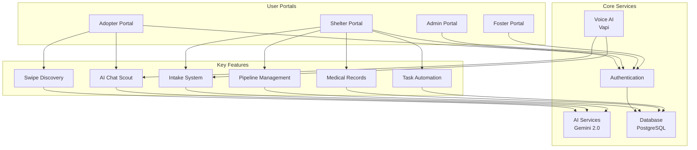

## User Journey Flow

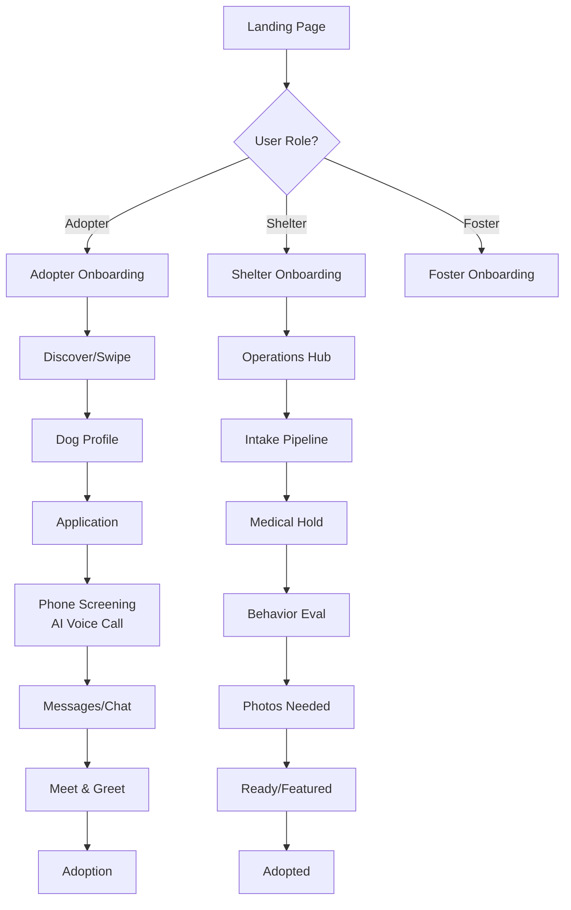

## Shelter Pipeline Status Flow

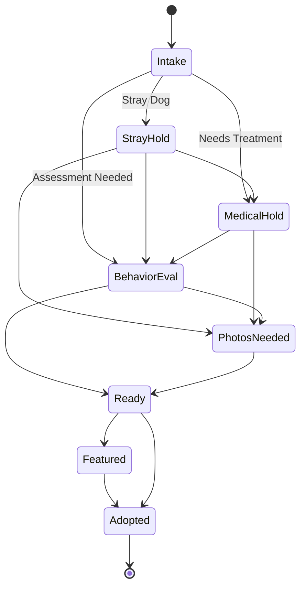

## Data Flow Architecture

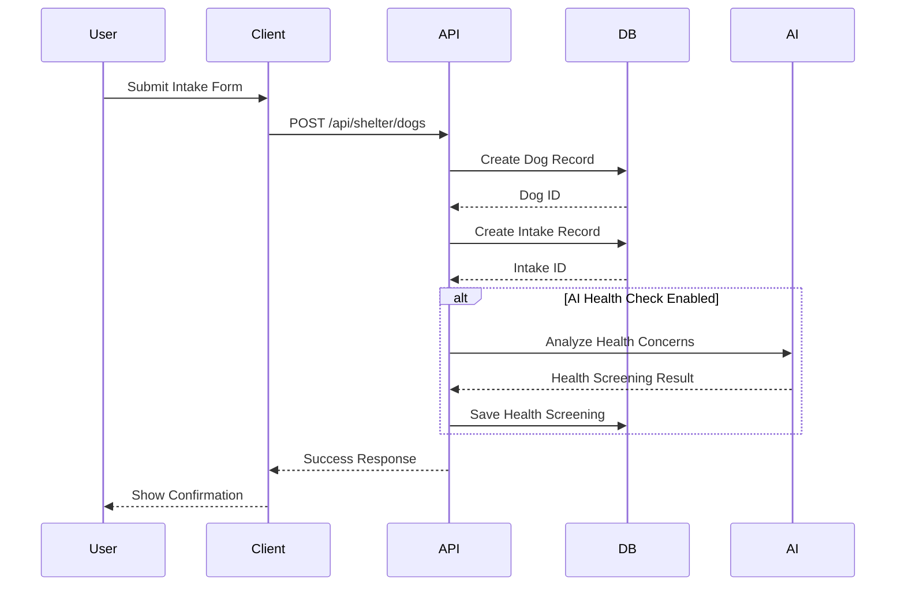

## Shelter Intake & Health Screening Flow

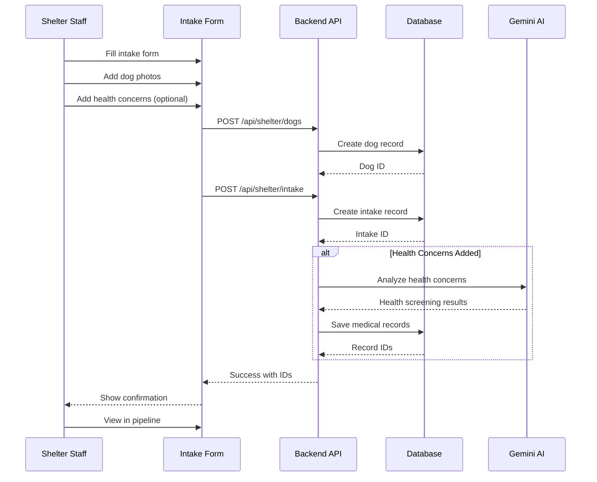

## User & Application Approval Pipeline Flow

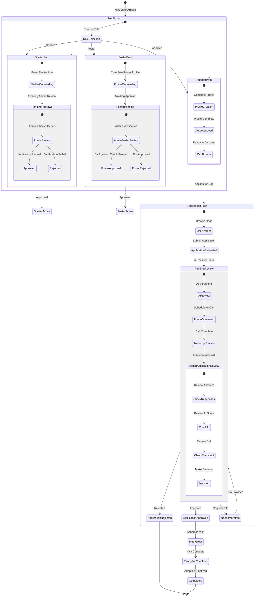

## Application Status Progression

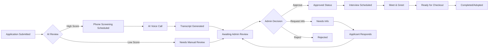

## Admin Review Dashboard Flow

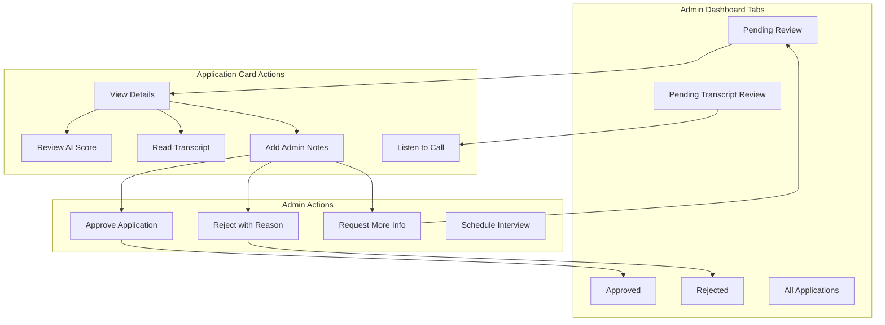

## Shelter Pipeline Drag & Drop Flow

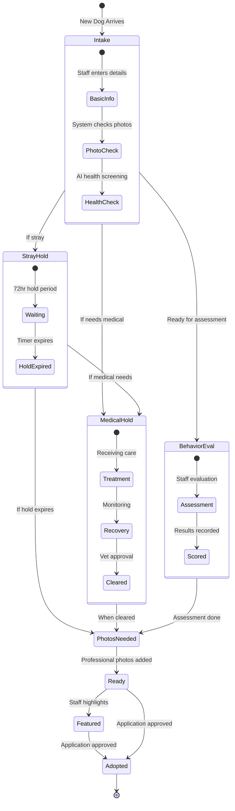

## Task Automation System

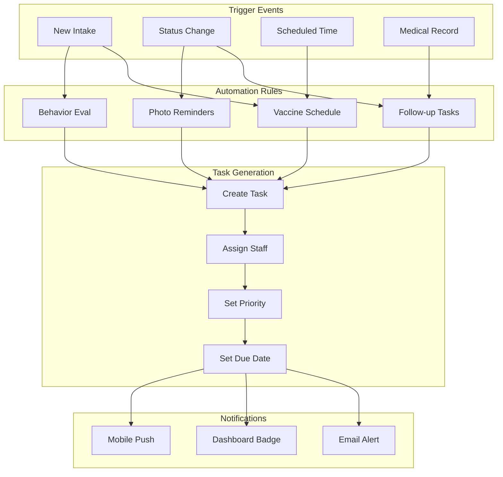

## Medical Records System

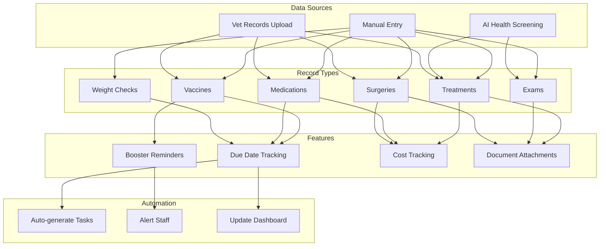

## API Route Map

```mermaid
graph TB
    subgraph "Shelter Routes"
        A[/api/shelter]
        A --> B[/dogs]
        A --> C[/intake]
        A --> D[/medical]
        A --> E[/applications]
        A --> F[/tasks]
        A --> G[/dashboard]
        A --> H[/pipeline]
        A --> I[/calendar]
        A --> J[/staff]
    end
    
    subgraph "Admin Routes"
        K[/api/admin]
        K --> L[/users]
        K --> M[/metrics]
        K --> N[/approvals]
        K --> O[/features]
        K --> P[/marketing]
        K --> Q[/knowledge-base]
    end
    
    subgraph "AI Services"
        R[/api/generate-pet-names]
        S[/api/analyze-photo]
        T[/api/health-screening]
    end
    
    subgraph "Voice AI"
        U[/api/vapi/webhook]
        V[/api/consultation/initiate]
    end
    
    B --> B1[GET - List<br/>POST - Create<br/>PUT - Update]
    C --> C1[POST - Create<br/>PATCH - Update Status]
    D --> D1[GET - Records<br/>POST - Add Record<br/>POST - Health Screening]
    E --> E1[GET - List<br/>PATCH - Update]
    F --> F1[GET - List<br/>POST - Create<br/>PATCH - Complete]
    G --> G1[GET - Metrics]
    H --> H1[GET - Dogs by Stage]
```

## Database Schema Overview

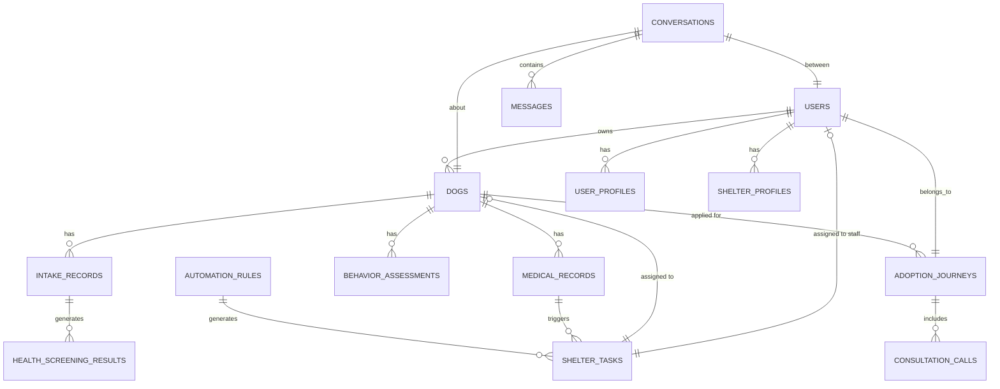

## AI Integration Architecture

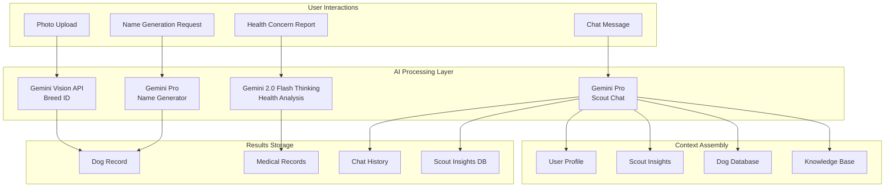

